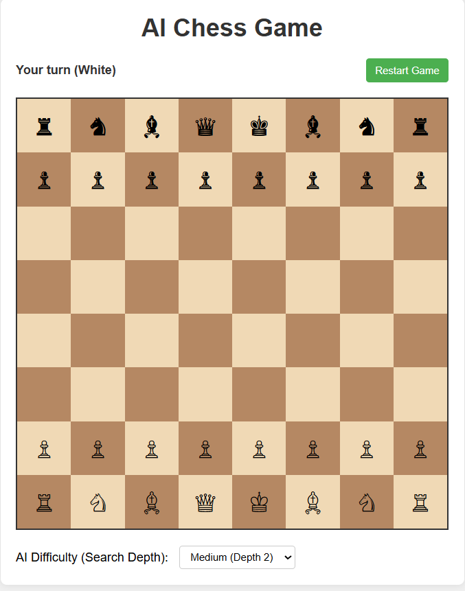

# Human vs AI Chess Game - Beginner's Guide

This guide explains every part of the chess game implementation in simple terms. It's designed to help beginners understand how the code works, particularly focusing on the AI opponent that uses the minimax algorithm.

## Table of Contents

1. [How to Run](#how-to-run)
2. [Prerequisites](#prerequisites)
3. [How to Play](#how-to-play-the-game)
4. [Algorithm Used](#algorithm-used)
5. [Screenshots](#screenshots)
6. [HTML Structure](#html-structure)
7. [CSS Styling](#css-styling)
8. [JavaScript Implementation](#javascript-implementation)
   - [Game Setup](#game-setup)
   - [Board Rendering](#board-rendering)
   - [User Interaction](#user-interaction)
   - [AI Implementation](#ai-implementation)
   - [Minimax Algorithm](#minimax-algorithm)
   - [Alpha-Beta Pruning](#alpha-beta-pruning)
   - [Board Evaluation](#board-evaluation)
   - [Chess Rules Implementation](#chess-rules-implementation)
9. [Possible Improvements](#possible-improvements)
10. [Advanced Improvements for Chess AI](#advanced-improvements-for-chess-ai)
11. [Conclusion](#conclusion)

## How to Run

Running this chess game is simple and requires no installation of additional software. Follow these steps:

### Method 1: Direct File Opening

1. **Download/Clone** the project files to your computer
2. **Navigate** to the `chess-ai` folder
3. **Open** the `index.html` file in any modern web browser:
   - **Windows**: Double-click `index.html` or right-click → "Open with" → Choose your browser
   - **Mac**: Double-click `index.html` or right-click → "Open With" → Choose your browser
   - **Linux**: Double-click `index.html` or use `xdg-open index.html` in terminal

### Method 2: Local Server (Recommended for Development)

If you plan to modify the code, running a local server is recommended:

1. **Using Python** (if installed):

   ```bash
   # Python 3
   python -m http.server 8000

   # Python 2
   python -m SimpleHTTPServer 8000
   ```

   Then open `http://localhost:8000` in your browser

2. **Using Node.js** (if installed):

   ```bash
   npx http-server
   ```

   Then open the provided URL in your browser

3. **Using VS Code Live Server Extension**:
   - Install the "Live Server" extension in VS Code
   - Right-click on `index.html` and select "Open with Live Server"

## Prerequisites

This chess game is built using standard web technologies and requires **no additional software installation**. Here's what you need:

### Required

- **Modern Web Browser**: Any recent version of:
  - Google Chrome (recommended)
  - Mozilla Firefox
  - Microsoft Edge
  - Safari
  - Opera

### Optional (for development/modification)

- **Text Editor/IDE**: If you want to modify the code:
  - Visual Studio Code (recommended)
  - Sublime Text
  - Atom
  - Notepad++
  - Any text editor

### Browser Compatibility

- **JavaScript ES6+**: The game uses modern JavaScript features
- **CSS Grid**: For board layout
- **HTML5**: Standard HTML5 support

### No External Dependencies

- No libraries or frameworks required
- No internet connection needed (after downloading)
- No package managers (npm, yarn, etc.)
- No build tools or compilation step

## How to Play the Game

This is a classic chess game where you (White pieces) play against an AI opponent (Black pieces).

### Basic Rules

- **Objective**: Checkmate the opponent's king
- **You play as White** and always move first
- **AI plays as Black** and responds to your moves

### Making Moves

1. **Select a Piece**: Click on any of your white pieces
2. **See Valid Moves**: Legal moves are highlighted with small dots
3. **Make Your Move**: Click on any highlighted square to move your piece
4. **AI Response**: The AI will automatically make its move after yours

### Piece Movement

- **Pawn** ♙: Moves forward one square, captures diagonally, can move two squares on first move
- **Rook** ♖: Moves horizontally or vertically any number of squares
- **Knight** ♘: Moves in an L-shape (2+1 squares)
- **Bishop** ♗: Moves diagonally any number of squares
- **Queen** ♕: Combines rook and bishop movement
- **King** ♔: Moves one square in any direction

### Special Rules Implemented

- **Pawn Promotion**: Pawns reaching the opposite end automatically become queens
- **Check Detection**: You cannot make moves that leave your king in check
- **Checkmate**: Game ends when the king is in check with no legal moves
- **Stalemate**: Game ends in a draw when no legal moves exist but king isn't in check

### Game Controls

- **Restart Button**: Start a new game at any time
- **Difficulty Selector**: Choose AI search depth:
  - Easy (Depth 1): AI looks 1 move ahead
  - Medium (Depth 2): AI looks 2 moves ahead (default)
  - Hard (Depth 3): AI looks 3 moves ahead

### Tips for Playing

1. **Control the Center**: Place pieces in central squares early
2. **Develop Pieces**: Move knights and bishops before other pieces
3. **Protect Your King**: Keep your king safe behind pawns
4. **Think Ahead**: Consider what the AI might do in response to your moves

## Algorithm Used

This chess game implements a sophisticated AI using the **Minimax Algorithm with Alpha-Beta Pruning**.

### Minimax Algorithm

The core AI decision-making algorithm:

#### How It Works

1. **Tree Search**: The AI creates a game tree of possible moves
2. **Depth-Limited**: Searches to a specified depth (1-3 moves ahead)
3. **Alternating Players**:
   - **Maximizing Player** (AI/Black): Tries to maximize the evaluation score
   - **Minimizing Player** (Human/White): Tries to minimize the evaluation score
4. **Recursive Evaluation**: Each position is evaluated recursively until max depth

#### Pseudocode

```
function minimax(position, depth, isMaximizing):
    if depth == 0:
        return evaluate(position)

    if isMaximizing:
        maxScore = -infinity
        for each possible move:
            score = minimax(makeMove(move), depth-1, false)
            maxScore = max(maxScore, score)
        return maxScore
    else:
        minScore = +infinity
        for each possible move:
            score = minimax(makeMove(move), depth-1, true)
            minScore = min(minScore, score)
        return minScore
```

### Alpha-Beta Pruning

An optimization technique that significantly improves performance:

#### Purpose

- **Reduces Search Time**: Eliminates branches that won't affect the final decision
- **Same Result**: Produces identical results to pure minimax but faster
- **Pruning Condition**: When `beta ≤ alpha`, stop evaluating remaining moves

#### Benefits

- **Performance**: Can reduce search time from O(b^d) to O(b^(d/2)) in best case
- **Deeper Search**: Allows AI to look further ahead in the same time
- **Real-time Play**: Keeps response times reasonable for interactive gameplay

### Position Evaluation

The AI evaluates chess positions using:

#### Material Count (Primary Factor)

- **Pawn**: 10 points
- **Knight/Bishop**: 30 points
- **Rook**: 50 points
- **Queen**: 90 points
- **King**: 900 points

#### Evaluation Formula

```javascript
score = Σ(AI_pieces_value) - Σ(Human_pieces_value) + random_factor;
```

#### Additional Factors

- **Random Element**: Small random factor prevents repetitive play
- **Future Enhancements**: Position could consider piece placement, king safety, mobility

### Algorithm Complexity

- **Time Complexity**: O(b^d) where b = branching factor (~35 in chess), d = depth
- **Space Complexity**: O(d) for recursion stack
- **With Alpha-Beta**: Average case O(b^(d/2)), significantly faster

### Why This Algorithm?

1. **Proven Effective**: Used in many successful chess engines
2. **Optimal Play**: Finds the best move within search depth
3. **Adjustable Difficulty**: Depth parameter controls AI strength
4. **Educational Value**: Demonstrates classic AI game-playing techniques

## Screenshots

Below are screenshots showing the chess game in action:

### Main Game Interface


_The main game interface showing the chess board with pieces in starting position_

### Game in Progress


_A game in progress showing selected piece (highlighted in blue) and valid moves (marked with dots)_

### AI Thinking


_The AI calculating its next move - status shows "AI is thinking..."_

### Game End - Checkmate


_Game ending with checkmate - status shows the winner_

### Difficulty Settings


_AI difficulty selection dropdown showing Easy, Medium, and Hard options_

### Key Features Shown

- **Clean Interface**: Modern, intuitive design
- **Visual Feedback**: Selected pieces highlighted, valid moves marked
- **Status Updates**: Clear indication of game state and whose turn it is
- **Responsive Design**: Works well on different screen sizes
- **Professional Appearance**: Uses Unicode chess symbols for authentic look

_Note: To view the actual screenshots, ensure the `screenshots` folder exists in the project directory with the corresponding image files._

## HTML Structure

The HTML file (`index.html`) provides the basic structure for our chess game:

```html
<!DOCTYPE html>
<html lang="en">
  <head>
    <meta charset="UTF-8" />
    <meta name="viewport" content="width=device-width, initial-scale=1.0" />
    <title>AI Chess Game</title>
    <link rel="stylesheet" href="styles.css" />
  </head>
  <body>
    <div class="container">
      <h1>Human vs AI Chess Game</h1>
      <div class="game-info">
        <div id="status">Your turn (White)</div>
        <button id="restart-btn">Restart Game</button>
      </div>
      <div id="board" class="chess-board"></div>
      <div class="settings">
        <label for="difficulty">AI Difficulty (Search Depth):</label>
        <select id="difficulty">
          <option value="1">Easy (Depth 1)</option>
          <option value="2" selected>Medium (Depth 2)</option>
          <option value="3">Hard (Depth 3)</option>
        </select>
      </div>
    </div>
    <script src="script.js"></script>
  </body>
</html>
```

### Explanation:

- **Document Structure**: The standard HTML5 document structure with `<!DOCTYPE html>` declaration.
- **Head Section**: Contains metadata, title, and links to the CSS file.
- **Body Section**: Contains the main content of our chess game.
- **Container**: A wrapper div to hold all our game elements.
- **Game Info**: Displays the current status of the game and the restart button.
- **Chess Board**: An empty div with ID "board" that will be filled with squares using JavaScript.
- **Settings**: A dropdown to select the difficulty level of the AI.
- **JavaScript Link**: Loads the script.js file at the end of the body.

## CSS Styling

The CSS file (`styles.css`) provides styling for our chess game:

```css
* {
  margin: 0;
  padding: 0;
  box-sizing: border-box;
}

body {
  font-family: Arial, sans-serif;
  background-color: #f0f0f0;
  display: flex;
  justify-content: center;
  padding: 20px;
}

.container {
  max-width: 600px;
  width: 100%;
  background-color: white;
  border-radius: 8px;
  box-shadow: 0 0 10px rgba(0, 0, 0, 0.1);
  padding: 20px;
}

/* ... more CSS ... */

.chess-board {
  display: grid;
  grid-template-columns: repeat(8, 1fr);
  grid-template-rows: repeat(8, 1fr);
  width: 100%;
  aspect-ratio: 1 / 1;
  border: 2px solid #333;
  margin-bottom: 20px;
}

.square {
  display: flex;
  justify-content: center;
  align-items: center;
  font-size: 2rem;
  cursor: pointer;
  transition: background-color 0.2s;
}

.white {
  background-color: #f0d9b5;
}

.black {
  background-color: #b58863;
}

.square.selected {
  background-color: #aec6cf;
}

.square.valid-move {
  position: relative;
}

.square.valid-move::after {
  content: "";
  position: absolute;
  width: 25%;
  height: 25%;
  background-color: rgba(0, 0, 0, 0.2);
  border-radius: 50%;
}
```

### Explanation:

- **Reset Styles**: The `*` selector resets margin, padding, and box-sizing for all elements.
- **Body Styling**: Centers the content on the page with a light gray background.
- **Container**: Styles the main container with a white background, rounded corners, and a shadow.
- **Chess Board**: Uses CSS Grid to create an 8x8 grid for the chess board.
- **Square Styling**: Styles each square on the board, with different colors for white and black squares.
- **Selected Square**: Highlights the currently selected piece with a blue background.
- **Valid Move Indicator**: Shows a small dot on squares where the selected piece can move.

## JavaScript Implementation

The JavaScript file (`script.js`) contains all the game logic, including chess rules and the AI opponent. Let's break it down section by section:

### Game Setup

```javascript
// Chess pieces Unicode characters
const PIECES = {
  white: {
    pawn: "♙",
    rook: "♖",
    knight: "♘",
    bishop: "♗",
    queen: "♕",
    king: "♔",
  },
  black: {
    pawn: "♟",
    rook: "♜",
    knight: "♞",
    bishop: "♝",
    queen: "♛",
    king: "♚",
  },
};

// Initial board setup
const INITIAL_BOARD = [
  ["br", "bn", "bb", "bq", "bk", "bb", "bn", "br"],
  ["bp", "bp", "bp", "bp", "bp", "bp", "bp", "bp"],
  ["", "", "", "", "", "", "", ""],
  ["", "", "", "", "", "", "", ""],
  ["", "", "", "", "", "", "", ""],
  ["", "", "", "", "", "", "", ""],
  ["wp", "wp", "wp", "wp", "wp", "wp", "wp", "wp"],
  ["wr", "wn", "wb", "wq", "wk", "wb", "wn", "wr"],
];

// Game state
let board = [];
let selectedPiece = null;
let currentPlayer = "white";
let validMoves = [];
let gameOver = false;

// DOM elements
const boardElement = document.getElementById("board");
const statusElement = document.getElementById("status");
const restartButton = document.getElementById("restart-btn");
const difficultySelect = document.getElementById("difficulty");
```

### Explanation:

- **Chess Pieces**: A dictionary of Unicode symbols for each chess piece. These symbols will be displayed on the board.
- **Initial Board**: A 2D array representing the starting position of a chess game. Each piece is represented by a two-character code:
  - First character: 'w' for white, 'b' for black
  - Second character: 'p' for pawn, 'r' for rook, 'n' for knight, 'b' for bishop, 'q' for queen, 'k' for king
  - Empty squares are represented by empty strings.
- **Game State Variables**:
  - `board`: The current state of the board
  - `selectedPiece`: The currently selected piece (if any)
  - `currentPlayer`: Whose turn it is ('white' or 'black')
  - `validMoves`: A list of valid moves for the selected piece
  - `gameOver`: Whether the game has ended
- **DOM Elements**: References to HTML elements that we'll need to update as the game progresses.

### Game Initialization

```javascript
// Initialize the game
function initGame() {
  board = JSON.parse(JSON.stringify(INITIAL_BOARD));
  selectedPiece = null;
  currentPlayer = "white";
  validMoves = [];
  gameOver = false;
  statusElement.textContent = "Your turn (White)";
  renderBoard();
}
```

### Explanation:

- **Deep Copy**: `JSON.parse(JSON.stringify(INITIAL_BOARD))` creates a deep copy of the initial board, so we can reset the game without affecting the original.
- **Reset Variables**: Clear all game state variables to their starting values.
- **Update Status**: Set the status text to indicate it's the player's turn.
- **Render Board**: Call the function to display the board on the screen.

### Board Rendering

```javascript
// Render the chess board
function renderBoard() {
  boardElement.innerHTML = "";

  for (let row = 0; row < 8; row++) {
    for (let col = 0; col < 8; col++) {
      const square = document.createElement("div");
      square.className = `square ${(row + col) % 2 === 0 ? "white" : "black"}`;
      square.dataset.row = row;
      square.dataset.col = col;

      if (board[row][col]) {
        const piece = board[row][col];
        const color = piece[0] === "w" ? "white" : "black";
        const type = getPieceType(piece[1]);
        square.textContent = PIECES[color][type];
      }

      if (
        selectedPiece &&
        selectedPiece.row === row &&
        selectedPiece.col === col
      ) {
        square.classList.add("selected");
      }

      if (validMoves.some((move) => move.row === row && move.col === col)) {
        square.classList.add("valid-move");
      }

      square.addEventListener("click", () => handleSquareClick(row, col));
      boardElement.appendChild(square);
    }
  }
}
```

### Explanation:

- **Clear Board**: Empty the board element to start fresh.
- **Create Squares**: Create 64 div elements (8×8) for the chess board.
- **Alternating Colors**: Use the formula `(row + col) % 2 === 0` to determine if a square should be white or black.
- **Store Position**: Save the row and column in the dataset for later use.
- **Add Pieces**: If a square has a piece, display its Unicode symbol.
- **Highlight Selected**: If a piece is selected, add the 'selected' class to highlight it.
- **Show Valid Moves**: If a square is a valid move for the selected piece, add the 'valid-move' class.
- **Add Click Handler**: When a square is clicked, call the handleSquareClick function.
- **Append to Board**: Add the square to the board element.

### User Interaction

```javascript
// Handle click on a square
function handleSquareClick(row, col) {
  if (gameOver || currentPlayer === "black") return;

  const piece = board[row][col];

  // If a piece is already selected
  if (selectedPiece) {
    // Check if clicked on a valid move
    const moveIndex = validMoves.findIndex(
      (move) => move.row === row && move.col === col
    );

    if (moveIndex !== -1) {
      // Make the move
      const move = validMoves[moveIndex];
      makeMove(selectedPiece.row, selectedPiece.col, move.row, move.col);

      // Reset selection
      selectedPiece = null;
      validMoves = [];

      // Check if game is over
      if (isCheckmate("black")) {
        gameOver = true;
        statusElement.textContent = "Checkmate! You win!";
        return;
      }

      // AI's turn
      currentPlayer = "black";
      statusElement.textContent = "AI is thinking...";
      renderBoard();

      // Allow UI to update before AI makes a move
      setTimeout(makeAIMove, 500);
      return;
    }

    // Clicked on another square, reset selection
    selectedPiece = null;
    validMoves = [];
  }

  // Select a piece if it belongs to the current player
  if (piece && piece[0] === "w") {
    selectedPiece = { row, col };
    validMoves = getValidMoves(row, col);
  }

  renderBoard();
}
```

### Explanation:

- **Game State Check**: If the game is over or it's the AI's turn, ignore the click.
- **Piece Selection Logic**:
  - If a piece is already selected:
    - Check if the clicked square is a valid move.
    - If it is, make the move and let the AI take its turn.
    - If not, reset the selection.
  - If no piece is selected:
    - If the clicked square contains a player's piece, select it and calculate its valid moves.
- **Checkmate Check**: After a move, check if the opponent is in checkmate.
- **AI Turn**: Change the current player to 'black' and trigger the AI to make a move after a short delay.
- **Update Display**: Re-render the board to reflect the new state.

### AI Implementation

```javascript
// Make AI move using minimax algorithm
function makeAIMove() {
  const depth = parseInt(difficultySelect.value);
  const bestMove = findBestMove(depth);

  if (bestMove) {
    makeMove(
      bestMove.fromRow,
      bestMove.fromCol,
      bestMove.toRow,
      bestMove.toCol
    );

    // Check if game is over
    if (isCheckmate("white")) {
      gameOver = true;
      statusElement.textContent = "Checkmate! AI wins!";
      renderBoard();
      return;
    }

    currentPlayer = "white";
    statusElement.textContent = "Your turn (White)";
  } else {
    // No valid moves for AI
    if (isCheck("black")) {
      gameOver = true;
      statusElement.textContent = "Checkmate! You win!";
    } else {
      gameOver = true;
      statusElement.textContent = "Stalemate! Game is a draw!";
    }
  }

  renderBoard();
}

// Find the best move for AI using minimax algorithm
function findBestMove(depth) {
  let bestScore = -Infinity;
  let bestMove = null;

  // For each piece of the AI
  for (let row = 0; row < 8; row++) {
    for (let col = 0; col < 8; col++) {
      const piece = board[row][col];
      if (piece && piece[0] === "b") {
        const moves = getValidMoves(row, col);

        // For each valid move
        for (const move of moves) {
          // Make the move temporarily
          const savedPiece = board[move.row][move.col];
          board[move.row][move.col] = board[row][col];
          board[row][col] = "";

          // Evaluate the move using minimax
          const score = minimax(depth - 1, false, -Infinity, Infinity);

          // Undo the move
          board[row][col] = board[move.row][move.col];
          board[move.row][move.col] = savedPiece;

          // Update best move if found
          if (score > bestScore) {
            bestScore = score;
            bestMove = {
              fromRow: row,
              fromCol: col,
              toRow: move.row,
              toCol: move.col,
            };
          }
        }
      }
    }
  }

  return bestMove;
}
```

### Explanation:

- **makeAIMove Function**:

  - Get the selected difficulty level (search depth)
  - Find the best move using the minimax algorithm
  - Make the move and check if the player is in checkmate
  - If the AI has no valid moves, determine if it's checkmate or stalemate
  - Update the game state and display

- **findBestMove Function**:
  - Initialize variables to track the best score and move
  - Iterate through all AI pieces and their possible moves
  - For each move:
    - Make the move temporarily
    - Evaluate the position using the minimax algorithm
    - Undo the move
    - If this move is better than the previous best, update the best move
  - Return the best move found

### Minimax Algorithm

```javascript
// Minimax algorithm with alpha-beta pruning
function minimax(depth, isMaximizing, alpha, beta) {
  // Base case: reached maximum depth
  if (depth === 0) {
    return evaluateBoard();
  }

  if (isMaximizing) {
    // AI's turn (maximizing)
    let maxScore = -Infinity;

    // For each piece of the AI
    for (let row = 0; row < 8; row++) {
      for (let col = 0; col < 8; col++) {
        const piece = board[row][col];
        if (piece && piece[0] === "b") {
          const moves = getValidMoves(row, col);

          // For each valid move
          for (const move of moves) {
            // Make the move temporarily
            const savedPiece = board[move.row][move.col];
            board[move.row][move.col] = board[row][col];
            board[row][col] = "";

            // Recursively call minimax
            const score = minimax(depth - 1, false, alpha, beta);

            // Undo the move
            board[row][col] = board[move.row][move.col];
            board[move.row][move.col] = savedPiece;

            // Update max score
            maxScore = Math.max(maxScore, score);
            alpha = Math.max(alpha, score);

            // Alpha-beta pruning
            if (beta <= alpha) {
              break;
            }
          }
        }
      }
    }

    return maxScore;
  } else {
    // Human's turn (minimizing)
    let minScore = Infinity;

    // For each piece of the human
    for (let row = 0; row < 8; row++) {
      for (let col = 0; col < 8; col++) {
        const piece = board[row][col];
        if (piece && piece[0] === "w") {
          const moves = getValidMoves(row, col);

          // For each valid move
          for (const move of moves) {
            // Make the move temporarily
            const savedPiece = board[move.row][move.col];
            board[move.row][move.col] = board[row][col];
            board[row][col] = "";

            // Recursively call minimax
            const score = minimax(depth - 1, true, alpha, beta);

            // Undo the move
            board[row][col] = board[move.row][move.col];
            board[move.row][move.col] = savedPiece;

            // Update min score
            minScore = Math.min(minScore, score);
            beta = Math.min(beta, score);

            // Alpha-beta pruning
            if (beta <= alpha) {
              break;
            }
          }
        }
      }
    }

    return minScore;
  }
}
```

### Explanation:

The minimax algorithm is at the heart of the AI's decision-making process. It works like this:

1. **Base Case**: If we've reached the maximum search depth, evaluate the current board position.

2. **Maximizing Player (AI)**:

   - The AI wants to maximize the score.
   - Try all possible moves for all AI pieces.
   - For each move:
     - Make the move temporarily.
     - Recursively call minimax to see what the human would do in response.
     - Undo the move.
     - If the move results in a better score, update the best score.

3. **Minimizing Player (Human)**:

   - The human wants to minimize the score.
   - Try all possible moves for all human pieces.
   - For each move:
     - Make the move temporarily.
     - Recursively call minimax to see what the AI would do in response.
     - Undo the move.
     - If the move results in a worse score, update the worst score.

4. **Recursion**: The algorithm calls itself repeatedly, alternating between maximizing and minimizing players, until it reaches the maximum depth.

### Alpha-Beta Pruning

Alpha-beta pruning is an optimization technique used in the minimax algorithm to reduce the number of positions that need to be evaluated. Here's how it works:

- **Alpha**: The best score the maximizing player (AI) can guarantee so far.
- **Beta**: The best score the minimizing player (human) can guarantee so far.

If at any point `beta <= alpha`, we can stop evaluating more moves because we know the opponent would never allow us to reach this position. This significantly reduces the search space and allows the AI to look deeper without taking too much time.

### Finding the Best Move

The `findBestMove` function uses minimax to evaluate all possible moves and choose the best one:

```javascript
function findBestMove(depth) {
  let bestScore = -Infinity;
  let bestMove = null;

  // For each piece of the AI
  for (let row = 0; row < 8; row++) {
    for (let col = 0; col < 8; col++) {
      const piece = board[row][col];
      if (piece && piece[0] === "b") {
        const moves = getValidMoves(row, col);

        // For each valid move
        for (const move of moves) {
          // Make the move temporarily
          const savedPiece = board[move.row][move.col];
          board[move.row][move.col] = board[row][col];
          board[row][col] = "";

          // Evaluate the move using minimax
          const score = minimax(depth - 1, false, -Infinity, Infinity);

          // Undo the move
          board[row][col] = board[move.row][move.col];
          board[move.row][move.col] = savedPiece;

          // Update best move if found
          if (score > bestScore) {
            bestScore = score;
            bestMove = {
              fromRow: row,
              fromCol: col,
              toRow: move.row,
              toCol: move.col,
            };
          }
        }
      }
    }
  }

  return bestMove;
}
```

This function:

1. Tries every possible move for the AI
2. Uses minimax to evaluate each move
3. Keeps track of the move with the highest score
4. Returns the best move found

### Board Evaluation

```javascript
// Evaluate the current board state
function evaluateBoard() {
  let score = 0;

  // Piece values
  const pieceValues = {
    p: 10,
    n: 30,
    b: 30,
    r: 50,
    q: 90,
    k: 900,
  };

  // Count material for both sides
  for (let row = 0; row < 8; row++) {
    for (let col = 0; col < 8; col++) {
      const piece = board[row][col];
      if (piece) {
        const value = pieceValues[piece[1]];
        if (piece[0] === "b") {
          score += value;
        } else {
          score -= value;
        }
      }
    }
  }

  // Add a small random factor to prevent repetitive moves
  score += Math.random() - 0.5;

  return score;
}
```

### Explanation:

The board evaluation function is crucial for the minimax algorithm. It assigns a numerical value to a board position, indicating how favorable it is for the AI:

1. **Material Count**: The most basic way to evaluate a chess position is to count the value of the pieces each player has.

   - Pawns are worth 10 points
   - Knights and Bishops are worth 30 points
   - Rooks are worth 50 points
   - Queens are worth 90 points
   - Kings are worth 900 points (not technically relevant since kings can't be captured, but useful for evaluation)

2. **Score Calculation**:

   - For each AI (Black) piece, add its value to the score
   - For each human (White) piece, subtract its value from the score
   - This means a positive score indicates an advantage for the AI, while a negative score indicates an advantage for the human

3. **Random Factor**:
   - A small random value between -0.5 and 0.5 is added to the score
   - This prevents the AI from repeating the same moves in similar positions
   - It adds a bit of variety to the AI's play

#### Limitations of the Simple Evaluation

Our evaluation function only considers material (the pieces on the board). Advanced chess engines consider many other factors:

1. **Piece Position**: Some squares are more valuable than others. For example:

   - Controlling the center is generally good
   - Knights are stronger in the center and weaker at the edges
   - Rooks are strong on open files
   - Pawns become more valuable as they advance

2. **King Safety**: Having pieces protecting your king and weakening the opponent's king position.

3. **Mobility**: Having more legal moves available is generally an advantage.

4. **Pawn Structure**: Factors like doubled pawns, isolated pawns, or passed pawns affect the position's strength.

5. **Development**: In the opening, having your pieces developed (moved from their starting positions) is important.

Adding these factors would make the AI much stronger, but also more complex. Our simple material-based evaluation is a good starting point and still creates a challenging opponent.

### Chess Rules Implementation in Detail

```javascript
// Make a move
function makeMove(fromRow, fromCol, toRow, toCol) {
  board[toRow][toCol] = board[fromRow][fromCol];
  board[fromRow][fromCol] = "";

  // Check for pawn promotion
  if (board[toRow][toCol] === "wp" && toRow === 0) {
    board[toRow][toCol] = "wq"; // Promote to queen
  } else if (board[toRow][toCol] === "bp" && toRow === 7) {
    board[toRow][toCol] = "bq"; // Promote to queen
  }
}

// Get valid moves for a piece
function getValidMoves(row, col) {
  const piece = board[row][col];
  if (!piece) return [];

  const color = piece[0];
  const type = piece[1];
  const moves = [];

  // Get potential moves based on piece type
  switch (type) {
    case "p":
      getPawnMoves(row, col, color, moves);
      break;
    case "r":
      getRookMoves(row, col, color, moves);
      break;
    case "n":
      getKnightMoves(row, col, color, moves);
      break;
    case "b":
      getBishopMoves(row, col, color, moves);
      break;
    case "q":
      getQueenMoves(row, col, color, moves);
      break;
    case "k":
      getKingMoves(row, col, color, moves);
      break;
  }

  // Filter out moves that would put or leave the king in check
  return moves.filter((move) => {
    // Make the move temporarily
    const savedPiece = board[move.row][move.col];
    board[move.row][move.col] = board[row][col];
    board[row][col] = "";

    // Check if the king is in check after the move
    const inCheck = isCheck(color);

    // Undo the move
    board[row][col] = board[move.row][move.col];
    board[move.row][move.col] = savedPiece;

    return !inCheck;
  });
}
```

### Explanation:

- **makeMove Function**:

  - Move the piece from the source square to the destination square.
  - Handle pawn promotion: if a pawn reaches the opposite end of the board, promote it to a queen.

- **getValidMoves Function**:
  - Get all possible moves for a piece based on its type.
  - Filter out moves that would leave the king in check.
  - This ensures that all moves are legal according to chess rules.

Let's look at how the moves for each piece type are generated:

#### Detailed Explanation of Piece Movement

Let's break down how each piece moves in our chess implementation:

##### 1. Pawn Movement

```javascript
// Get pawn moves
function getPawnMoves(row, col, color, moves) {
  const direction = color === "w" ? -1 : 1;
  const startRow = color === "w" ? 6 : 1;

  // Move forward one square
  if (isInBoard(row + direction, col) && !board[row + direction][col]) {
    moves.push({ row: row + direction, col });

    // Move forward two squares from starting position
    if (row === startRow && !board[row + 2 * direction][col]) {
      moves.push({ row: row + 2 * direction, col });
    }
  }

  // Capture diagonally
  for (let i = -1; i <= 1; i += 2) {
    if (
      isInBoard(row + direction, col + i) &&
      board[row + direction][col + i] &&
      board[row + direction][col + i][0] !== color
    ) {
      moves.push({ row: row + direction, col: col + i });
    }
  }
}
```

**Pawns** have unique movement rules:

- They move forward (up for black, down for white) one square at a time
- From their starting position, they can move two squares forward if both squares are empty
- They can only capture diagonally forward
- In our implementation, we check:
  - If the square directly in front is empty (to move forward)
  - If the pawn is on its starting row and both squares in front are empty (to move two squares)
  - If there are opponent pieces diagonally in front (to capture)
- Missing in this implementation: En passant captures (a special pawn capture rule)

##### 2. Rook Movement

```javascript
// Get rook moves
function getRookMoves(row, col, color, moves) {
  // Directions: up, right, down, left
  const directions = [
    [-1, 0],
    [0, 1],
    [1, 0],
    [0, -1],
  ];

  for (const [dRow, dCol] of directions) {
    let newRow = row + dRow;
    let newCol = col + dCol;

    while (isInBoard(newRow, newCol)) {
      if (!board[newRow][newCol]) {
        // Empty square
        moves.push({ row: newRow, col: newCol });
      } else {
        // Square has a piece
        if (board[newRow][newCol][0] !== color) {
          // Opponent's piece, can capture
          moves.push({ row: newRow, col: newCol });
        }
        break; // Can't move further in this direction
      }

      newRow += dRow;
      newCol += dCol;
    }
  }
}
```

**Rooks** move horizontally or vertically any number of squares:

- We use an array of directions representing up, right, down, and left
- For each direction, we keep moving in that direction until:
  - We hit the edge of the board
  - We hit a piece (we can capture opponent pieces but not move beyond them)
  - We hit our own piece (we can't move there or beyond)
- This implementation correctly handles the "sliding" nature of rook movement

##### 3. Knight Movement

```javascript
// Get knight moves
function getKnightMoves(row, col, color, moves) {
  // All possible knight moves
  const knightMoves = [
    [-2, -1],
    [-2, 1],
    [-1, -2],
    [-1, 2],
    [1, -2],
    [1, 2],
    [2, -1],
    [2, 1],
  ];

  for (const [dRow, dCol] of knightMoves) {
    const newRow = row + dRow;
    const newCol = col + dCol;

    if (
      isInBoard(newRow, newCol) &&
      (!board[newRow][newCol] || board[newRow][newCol][0] !== color)
    ) {
      moves.push({ row: newRow, col: newCol });
    }
  }
}
```

**Knights** move in an L-shape: two squares in one direction and then one square perpendicular to that direction:

- We store all eight possible L-shaped moves a knight can make
- For each potential move, we check:
  - If the destination is on the board
  - If the destination square is either empty or contains an opponent's piece
- Knights are unique in that they can "jump over" other pieces

##### 4. Bishop Movement

```javascript
// Get bishop moves
function getBishopMoves(row, col, color, moves) {
  // Directions: up-left, up-right, down-right, down-left
  const directions = [
    [-1, -1],
    [-1, 1],
    [1, 1],
    [1, -1],
  ];

  for (const [dRow, dCol] of directions) {
    let newRow = row + dRow;
    let newCol = col + dCol;

    while (isInBoard(newRow, newCol)) {
      if (!board[newRow][newCol]) {
        // Empty square
        moves.push({ row: newRow, col: newCol });
      } else {
        // Square has a piece
        if (board[newRow][newCol][0] !== color) {
          // Opponent's piece, can capture
          moves.push({ row: newRow, col: newCol });
        }
        break; // Can't move further in this direction
      }

      newRow += dRow;
      newCol += dCol;
    }
  }
}
```

**Bishops** move diagonally any number of squares:

- Similar to rook movement, but in diagonal directions
- We use an array of directions representing up-left, up-right, down-right, and down-left
- The movement rules are the same: move until we hit the edge, an opponent's piece (which we can capture), or our own piece

##### 5. Queen Movement

```javascript
// Get queen moves (combination of rook and bishop)
function getQueenMoves(row, col, color, moves) {
  getRookMoves(row, col, color, moves);
  getBishopMoves(row, col, color, moves);
}
```

**Queens** combine the movement abilities of rooks and bishops:

- Rather than duplicate code, we simply call both the rook and bishop movement functions
- This allows the queen to move horizontally, vertically, and diagonally

##### 6. King Movement

```javascript
// Get king moves
function getKingMoves(row, col, color, moves) {
  // All possible king moves
  for (let dRow = -1; dRow <= 1; dRow++) {
    for (let dCol = -1; dCol <= 1; dCol++) {
      if (dRow === 0 && dCol === 0) continue;

      const newRow = row + dRow;
      const newCol = col + dCol;

      if (
        isInBoard(newRow, newCol) &&
        (!board[newRow][newCol] || board[newRow][newCol][0] !== color)
      ) {
        moves.push({ row: newRow, col: newCol });
      }
    }
  }
}
```

**Kings** move one square in any direction:

- We check all eight surrounding squares
- For each square, we check:
  - If it's on the board
  - If it's either empty or contains an opponent's piece
- Missing in this implementation: Castling (a special king move involving a rook)

#### Legal Move Filtering

After generating all possible moves for a piece, we filter out any moves that would leave the king in check:

```javascript
// Filter out moves that would put or leave the king in check
return moves.filter((move) => {
  // Make the move temporarily
  const savedPiece = board[move.row][move.col];
  board[move.row][move.col] = board[row][col];
  board[row][col] = "";

  // Check if the king is in check after the move
  const inCheck = isCheck(color);

  // Undo the move
  board[row][col] = board[move.row][move.col];
  board[move.row][move.col] = savedPiece;

  return !inCheck;
});
```

This is a crucial part of chess rules implementation:

- Even if a move is valid according to the piece's movement rules, it's illegal if it leaves your king in check
- For each potential move:
  1. We make the move temporarily
  2. We check if the king would be in check
  3. We undo the move
  4. If the king would be in check, we filter out that move
- This ensures all moves offered to the player and considered by the AI are legal according to chess rules

## Understanding the Minimax Algorithm

The minimax algorithm is what makes the AI "think" about its moves. Here's a simpler explanation:

1. **Looking Ahead**: The AI tries to look several moves ahead to find the best move.

2. **Taking Turns**: The algorithm simulates you making a move, then the AI, then you again, and so on.

3. **Scoring Positions**: Each possible final position is given a score based on which pieces are left.

4. **Best Move Selection**: The AI assumes:

   - You will always make the move that's worst for the AI.
   - The AI will always make the move that's best for itself.

5. **Depth Limitation**: Since there are too many possible positions to check them all, the AI only looks a certain number of moves ahead (the "depth").

### Example:

Imagine the AI is considering moving its knight. It thinks:

- "If I move my knight here, then the human could move their bishop to capture it."
- "But if I move my knight there instead, the human's best move would be to advance a pawn."
- "In the second case, I keep my knight, so that's better for me."

The AI will choose the second move because it leads to a better outcome.

## Possible Improvements

This chess game is intentionally kept simple, but there are many ways it could be improved:

1. **Better Evaluation**: Currently, the AI only considers the material value of pieces. A stronger evaluation would consider:

   - Piece positioning (controlling the center, etc.)
   - Pawn structure
   - King safety
   - Mobility

2. **Deeper Search**: Allowing higher depth values would make the AI stronger, but would require optimizations to keep it fast.

3. **Special Moves**: The current implementation doesn't include:

   - Castling
   - En passant captures
   - Underpromotion (promoting a pawn to something other than a queen)

4. **Draw Conditions**: The game doesn't check for draws due to:

   - Threefold repetition
   - 50-move rule
   - Insufficient material

5. **User Interface Improvements**:

   - Adding move history
   - Highlighting the last move
   - Adding animations

6. **Opening Book**: A pre-programmed set of good opening moves would make the AI play better at the start of the game.

7. **Learning Capability**: The AI could learn from previous games to improve its play over time.

## Conclusion

This detailed guide has explained every aspect of our chess game implementation, from the basic board setup to the advanced AI algorithms. By understanding how each part works, you can now:

1. **Play the Game**: Enjoy a challenging game of chess against the AI.
2. **Understand the Code**: Follow the logic of how pieces move, how the AI makes decisions, and how the game detects important states like check and checkmate.
3. **Modify the Game**: Armed with this knowledge, you can extend the game with new features or improvements.
4. **Learn About AI**: The minimax algorithm used in this chess game is a fundamental concept in artificial intelligence, applicable to many other games and problems.

Whether you're interested in chess, programming, or AI, we hope this guide has provided valuable insights and inspiration for your own projects. The combination of game rules, user interface, and decision-making algorithms in this chess implementation demonstrates how these different components can work together to create an engaging interactive experience.

Remember that the best way to learn is by experimenting. Try making changes to the code, adding new features, or optimizing existing ones. Each improvement you make will deepen your understanding of both chess and programming.

Happy coding and good luck in your games against the AI!


## Main Game Interface


_The main game interface showing the chess board with pieces in starting position_


### Key Features Shown

- **Clean Interface**: Modern, intuitive design
- **Visual Feedback**: Selected pieces highlighted, valid moves marked
- **Status Updates**: Clear indication of game state and whose turn it is
- **Responsive Design**: Works well on different screen sizes
- **Professional Appearance**: Uses Unicode chess symbols for authentic look

_Note: To view the actual screenshots, ensure the `screenshots` folder exists in the project directory with the corresponding image files._
