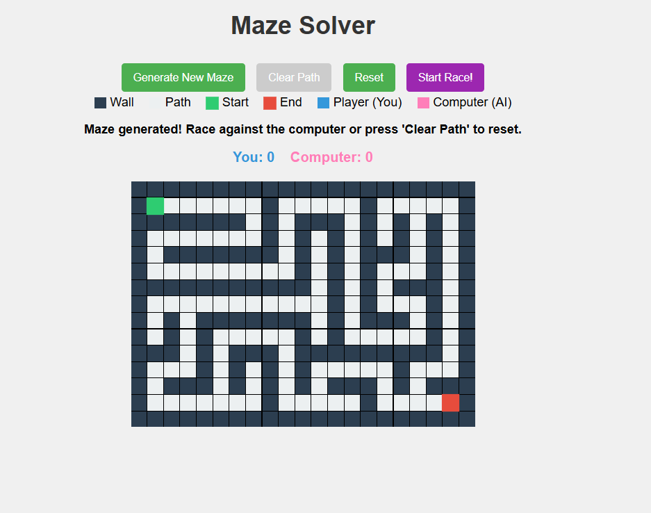

# Super Simple Maze Solver

A maze generation and racing game where you compete against a computer AI to reach the exit first. Features random maze generation using recursive backtracking and pathfinding algorithms.

## How to Run the Game

1. **Download the files**: Ensure you have both `super-simple-maze.html` and `super-simple-maze.js` in the same folder
2. **Open the HTML file**: Double-click on `super-simple-maze.html` to open it in your web browser
3. **Start playing**: The game will load automatically in your browser

## Prerequisites

**No installation required!** This game runs entirely in your web browser using:

- **HTML5** for the structure
- **CSS3** for styling
- **Vanilla JavaScript** for game logic

**Browser Requirements:**

- Any modern web browser (Chrome, Firefox, Safari, Edge)
- JavaScript enabled (enabled by default in most browsers)

## How to Play

1. **Generate a Maze**: Click the "Generate New Maze" button to create a random maze
2. **Start the Race**: Click "Start Race!" to begin competing against the computer
3. **Move Your Player**: Use the arrow keys or WASD keys to navigate through the maze
   - ↑/W: Move up
   - ↓/S: Move down
   - ←/A: Move left
   - →/D: Move right
4. **Win Condition**: Be the first to reach the red exit square
5. **Restart**: Press 'R' key during or after a race to restart
6. **Score Tracking**: Your wins vs computer wins are displayed at the top

## Algorithms Used

This game implements several important algorithms:

1. **Maze Generation**:

   - **Recursive Backtracking Algorithm** - Creates random mazes by carving paths through a grid of walls
   - Ensures every path is reachable and creates a single solution path

2. **Pathfinding**:

   - **Depth-First Search (DFS)** - The computer uses DFS to find a path from start to finish
   - Backtracking mechanism to explore all possible routes

3. **Game State Management**:
   - Event-driven programming for handling user input
   - Real-time collision detection for valid moves

---

### Main Game Interface

_The main game interface showing a generated maze with player (blue) and computer (green) racing to the exit_

### Key Features Shown

- **Random Maze Generation**: Unique maze layout created using recursive backtracking
- **Visual Distinction**: Clear color coding for walls, paths, players, and exit
- **Race Interface**: Player (blue dot) vs Computer (green dot) competition
- **Score Tracking**: Win counters displayed prominently at the top
- **Interactive Controls**: Responsive keyboard navigation for smooth gameplay
- **Game Controls**: Easy maze generation and race start buttons

_Note: Screenshots are stored in the `Screenshots` folder within the project directory._

---

**For detailed implementation guide and function explanations, see [DETAILED_GUIDE.md](DETAILED_GUIDE.md)**
