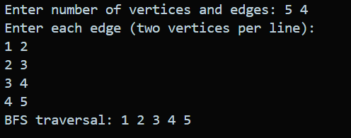
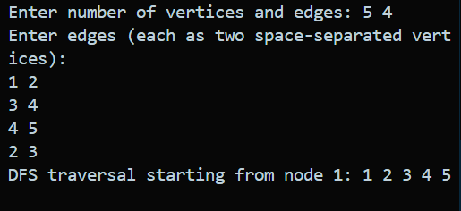
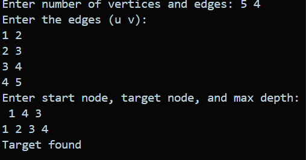
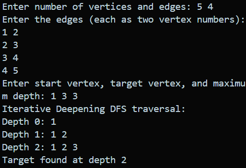
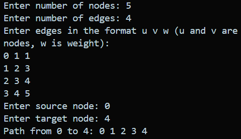
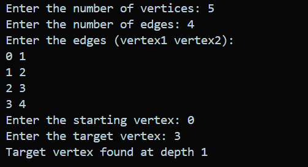
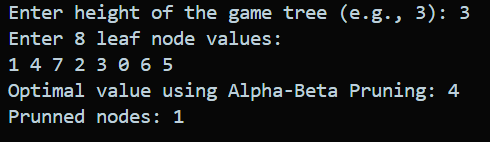

# Algorithm Implementation

This repository contains implementations of various AI and graph search algorithms in C++. Each algorithm is implemented with detailed examples and can be used for educational purposes or as building blocks for larger AI projects.

## Table of Contents

1. [Search Algorithms](#search-algorithms)
2. [Game Theory Algorithms](#game-theory-algorithms)
3. [Optimization Algorithms](#optimization-algorithms)
4. [Usage](#usage)
5. [Compilation](#compilation)

---

## Search Algorithms

### 1. Breadth-First Search (BFS)

**File:** `breadth_first_search.cpp`

#### How it works:

- Explores nodes level by level from the starting node
- Uses a queue (FIFO) to maintain the order of exploration
- Guarantees finding the shortest path in unweighted graphs

#### Applications:

- Finding shortest path in unweighted graphs
- Level-order traversal of trees
- Social networking (finding connections)
- Web crawling
- GPS navigation systems

#### Complexity:

- **Time Complexity:** O(V + E) where V = vertices, E = edges
- **Space Complexity:** O(V) for the queue and visited array

#### Input & Output Example:



---

### 2. Depth-First Search (DFS)

**File:** `depth_first_search.cpp`

#### How it works:

- Explores as far as possible along each branch before backtracking
- Uses a stack (LIFO) or recursion
- Does not guarantee shortest path

#### Applications:

- Topological sorting
- Detecting cycles in graphs
- Solving puzzles (maze solving)
- Finding connected components
- Pathfinding in game development

#### Complexity:

- **Time Complexity:** O(V + E)
- **Space Complexity:** O(V) for recursion stack/explicit stack

#### Input & Output Example:



---

### 3. Depth-Limited Search

**File:** `depth_limited_search.cpp`

#### How it works:

- DFS with a predetermined depth limit
- Prevents infinite loops in infinite state spaces
- Stops exploration when depth limit is reached

#### Applications:

- Game tree exploration with limited lookahead
- Resource-constrained search problems
- Iterative deepening search building block

#### Complexity:

- **Time Complexity:** O(b^l) where b = branching factor, l = depth limit
- **Space Complexity:** O(l)

#### Input & Output Example:



---

### 4. Iterative Deepening Search

**File:** `iterative_deepening_search.cpp`

#### How it works:

- Combines benefits of DFS and BFS
- Performs depth-limited search with increasing depth limits
- Repeats search with deeper limits until solution is found

#### Applications:

- Game playing when optimal move is needed
- Situations where depth of solution is unknown
- Memory-constrained environments

#### Complexity:

- **Time Complexity:** O(b^d) where d = depth of solution
- **Space Complexity:** O(d)

#### Input & Output Example:



---

### 5. Best-First Search

**File:** `best_first_search.cpp`, `best_first_search_dry_run.cpp`

#### How it works:

- Uses a heuristic function to guide search
- Explores nodes that appear most promising first
- Uses priority queue to maintain nodes by heuristic value

#### Applications:

- Route finding with heuristics
- Puzzle solving (8-puzzle, 15-puzzle)
- AI game playing
- Pathfinding in robotics

#### Complexity:

- **Time Complexity:** O(b^m) where m = maximum depth
- **Space Complexity:** O(b^m)

#### Input & Output Example:



---

### 6. A\* Search Algorithm

**File:** `a_star.cpp`

#### How it works:

- Combines actual cost (g) and heuristic cost (h)
- Uses f(n) = g(n) + h(n) to evaluate nodes
- Guarantees optimal path if heuristic is admissible

#### Applications:

- GPS navigation and route planning
- Video game pathfinding
- Robot motion planning
- Network routing protocols
- Puzzle solving

#### Complexity:

- **Time Complexity:** O(b^d) in worst case, much better with good heuristic
- **Space Complexity:** O(b^d)

---

### 7. Bidirectional Search

**File:** `bidirectional.cpp`, `bidirectional_search_path.cpp`

#### How it works:

- Runs two simultaneous searches from start and goal
- Searches meet in the middle
- Reduces search space significantly

#### Applications:

- Finding shortest path in large graphs
- Social network analysis (degrees of separation)
- Bioinformatics sequence alignment
- Database query optimization

#### Complexity:

- **Time Complexity:** O(b^(d/2)) - significant improvement over single-direction search
- **Space Complexity:** O(b^(d/2))

#### Input & Output Example:



---

### 8. Beam Search

**File:** `beam_search.cpp`

#### How it works:

- Limited-width best-first search
- Keeps only the best k nodes at each level (beam width = k)
- Trades completeness for efficiency

#### Applications:

- Natural language processing
- Speech recognition
- Machine translation
- Protein folding prediction
- Resource-constrained AI systems

#### Complexity:

- **Time Complexity:** O(k _ d _ b) where k = beam width
- **Space Complexity:** O(k \* d)

---

## Game Theory Algorithms

### 9. Minimax Algorithm

**File:** `minimax.cpp`

#### How it works:

- Two-player zero-sum game algorithm
- Maximizing player tries to maximize score
- Minimizing player tries to minimize score
- Recursively evaluates game tree

#### Applications:

- Chess, checkers, tic-tac-toe
- Board game AI
- Decision making in competitive scenarios
- Economic game theory

#### Complexity:

- **Time Complexity:** O(b^d) where b = branching factor, d = depth
- **Space Complexity:** O(d)

---

### 10. Alpha-Beta Pruning

**File:** `alpha_beta.cpp`, `alpha_beta_dry_run.cpp`, `minimax_alpha_beta_pruning.cpp`

#### How it works:

- Optimization of minimax algorithm
- Prunes branches that cannot affect final decision
- Maintains alpha (best maximizer option) and beta (best minimizer option)
- Cuts off search when alpha >= beta

#### Applications:

- Chess engines
- Game AI optimization
- Decision trees in machine learning
- Economic decision modeling

#### Complexity:

- **Time Complexity:** O(b^(d/2)) in best case, O(b^d) in worst case
- **Space Complexity:** O(d)

#### Input & Output Example:



---

## Optimization Algorithms

### 11. Hill Climbing

**File:** `hill_climbing.cpp`

#### How it works:

- Local search algorithm
- Always moves to the neighbor with highest value
- Stops when no neighbor is better (local optimum)
- Greedy approach that may get stuck in local maxima

#### Applications:

- Optimization problems
- Machine learning parameter tuning
- Traveling salesman problem (local optimization)
- Neural network training
- Resource allocation

#### Complexity:

- **Time Complexity:** O(n \* m) where n = number of steps, m = neighbors per step
- **Space Complexity:** O(1)

---

## Usage

Each algorithm is implemented as a standalone C++ program. To use any algorithm:

1. Choose the appropriate algorithm file
2. Compile using a C++ compiler
3. Run with appropriate input parameters

## Compilation

To compile any of the algorithms, use:

```bash
g++ -o algorithm_name algorithm_name.cpp
```

For example:

```bash
g++ -o a_star a_star.cpp
g++ -o bfs breadth_first_search.cpp
```

## Notes

- All algorithms are implemented for educational purposes
- Some files include "dry_run" versions for step-by-step execution visualization
- The implementations use standard C++ libraries
- Input formats may vary between algorithms - check individual file comments

## Contributing

Feel free to contribute by:

- Adding more algorithms
- Improving existing implementations
- Adding test cases
- Enhancing documentation

---

_This collection serves as a comprehensive reference for fundamental AI and search algorithms commonly used in computer science and artificial intelligence applications._
